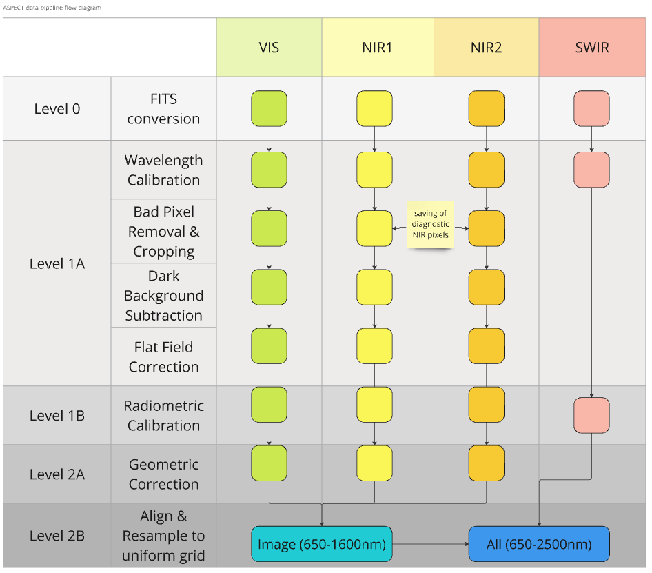

# Repository for ASPECT Data Pipeline Development

Lets keep the repository clean and organized.

## ASPECT Data Calibration Flow Diagram

## Requirements

pipeline tested with the following:

(Not a complete list)

- Python 3.10.3
- Hera SPICE Kernel Dataset

Python libraries:
- astropy 6.1.7
- spiceypy 6.0.0

### HERA SPICE Kernel Dataset

HERA SPICE Kernel Dataset is needed to retrieve geometry metadata related to ASPECT acquisitions. The pipeline stores the metadata in FITS headers.

HERA SPICE Kernel Dataset can be found in the following Bitbucket repository.

https://s2e2.cosmos.esa.int/bitbucket/projects/SPICE_KERNELS/repos/hera/browse

The following installation instructions are copied from there.

#### Installation

In order to use Git to obtain the operational subset of the SPICE Kernel Datased (SKD), the user needs to have Git installed. You can clone the repository with

    git clone --depth 1 https://s2e2.cosmos.esa.int/bitbucket/scm/spice_kernels/hera.git

Please be aware that due to the large historic of the repository and the large size of some binary kernels, timeout errors may occur if the --depth option is not used for performing a shallow clone. For more information please see the Known Issues section. 

In order to run the SKD in SPICE outside of the mk directory of the Git repository the user needs to modify the following PATH_VALUE variable of the meta-kernel:

    PATH_VALUES       = ( '..' )

This is found in e.g. .../HERA/kernels/mk/hera_ops.tm or .../HERA/kernels/mk/hera_plan.tm. Remember to use the appropriate metakernel. PATH_VALUES should point to the kernels directory like following:

	PATH_VALUES       = ( '.../SPICE/HERA/kernels' )

It is recommended for users to make a local copy of this file and modify the value of the PATH_VALUES keyword to point to the actual location of the hera SPICE data set's 'data' directory on their system. Replacing '/' with '\' and converting line terminators to the format native to the user's system may also be required if this meta-kernel is to be used on a non-UNIX workstation.

#### Updates

Updated version of the SKD need to be downloaded from the repository. This can be done by reinstalling the SKD each time, or more conveniently, there is also a Git Hook available in order to generate and update the meta-kernels. You can find more information on how to setup this Git Hook at "misc\git_hooks\skd_post_merge\README.md".

## Usage

### Spectra Corrections

To do

### Geometry Metadata Retrieval from SPICE Kernel Dataset

ASPECT_calibration_pipeline/fits_metadata.py calls SPICE queries in ASPECT_calibration_pipeline/hera_spice.py to retrieve SPICE metadata, and stores it into FITS headers.

Before usage, the user must open ASPECT_calibration_pipeline/fits_metadata.py and set the following variables:

- telemetry_path
- config_path
- spice_metakernel_path
- output_path
- image_target

Running the "main" function, retrieves metadata, writes it to the FITS, and saves the file to a specified location. If test_main = True, this is done automatically when running the file.

More information can be found in ASPECT_calibration_pipeline/fits_metadata.py and ASPECT_calibration_pipeline/hera_spice.py.

## Details

### Spectra Corrections

The spectra are corrected mainly with the following three ways:

1. Outlier Removal
1. Gaussian Smoothing
1. Offset Correction (NIR2)

#### Offset Correction (NIR2)

NIR2 offset correction calculates an offset for all NIR2 spectra values which is used to allign NIR1 and NIR2, forming a continuous spectrum and correcting a possible error gap in measurements caused by the hardware and its physical environment.

The offset is calculated by fitting a linear regression to the last 3 values of NIR1 and the first 3 values of NIR2, and then calculating the difference between the linear regressions at the wavelength 1225. The offset is then added to all NIR2 spectra values.

### SPICE Metadata Retrieval

The Hera SPICE Kernel Dataset contains ancillary information about various objects, spacecrafts, and instruments of the Hera mission. Most notably it provides geometric and positional information of the target which can be queried based on e.g. time, frame, and observer.

The ASPECT metadata that is retrieved from SPICE includes spacecraft position, image target position and distance, sun position, solar distance and elongation, earth position and distance, spacecraft quaternions (angle), and SPICE version. The queries are implemented in Python with the usage of SpiceyPy. During the pipeline development they use the metakernel "hera_plan.tm", and in asteroid phase "hera_ops.tm" to load the necessary kernels in the correct order. The SPICE kernels contain data which is used to provide the requested information based on the queries.