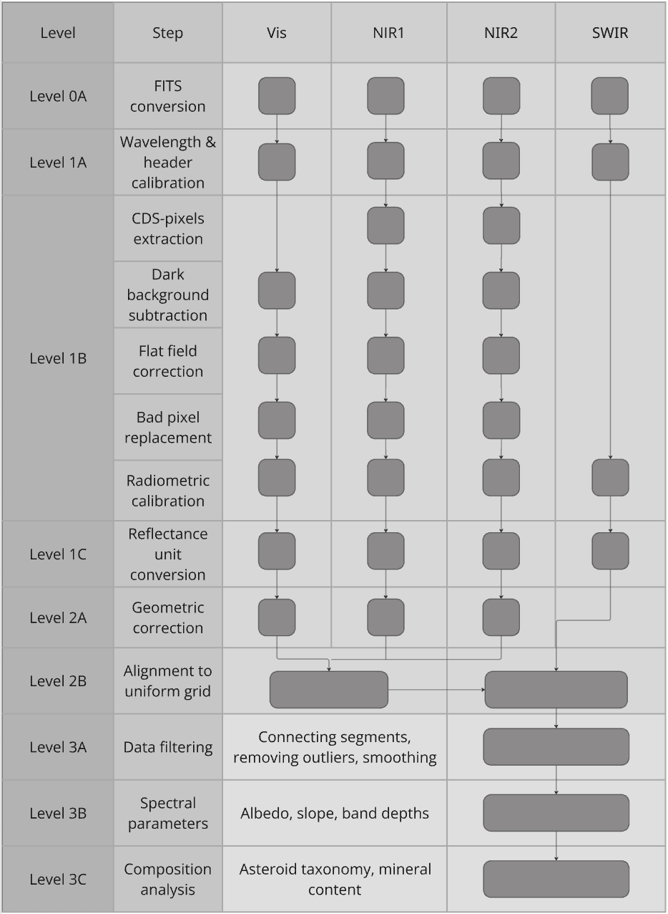

# Repository for ASPECT Data Pipeline Development

The ASPECT data processing pipeline was developed to address the need for accurate calibration of instrument data, to integrate data from the four sensors, and to apply analysis algorithms to ASPECT's hyperspectral data cubes. This README file explains the purpose and structure of the pipeline and guides how to install and run the pipeline properly.

## ASPECT Data Calibration Flow Diagram

The data pipeline is diveded into different levels based on the processing of data. Below is a diagram explaining the processing steps done at each level. 

## Installation

Clone the repository
`git clone https://github.com/ASPECT-pipeline/main.git`

(recommended) create a virtual environment

### Requirements

The project uses pip-tools to manage dependecy locking. All required packages are pinned in requirements.txt

run  
`pip install -r requirements.txt`  
to install the correct dependencies

(Optional for Developers) Updating Dependencies.  
If you are contributing or modifying dependencies, install pip-tools and regenerate:  
`pip install pip-tools`  
`pip-compile requirements.in`     # After modifying requirements.in rebuild requirements.txt  
`pip-sync`                        # Intall the new requirements.txt  

## Directory Structure
The algorithm relies on specific directory structures and absolute paths for file organisation.

The pipeline is located inside `ASPECT_calibration_pipeline`  
The program is diveded into `levels_012` and `level_3` directories.  
`levels_012` contains calibration functions for levels 0, 1, and 2.  
`level_3`contains analysis functions like Neural network for composition and taxonomy or MGM algorithm.  

## Data pipeline usage
The pipeline requires parameters that are defined in `ASPECT_calibration_pipeline/config.py`

### Update config.py
Before running the pipeline update the parameters in config.py to match your usecase.

`input_directory`= absolute path to the direcotry containing the input. The input directory should contain a sub directory starting with `acq_`, which contains the individual acquisition frames. The input directory should also contain a sub directory called `meta`, which contains telemetry.json and config.json files.

`output_directory` = absolute path to the directory where the pipeline should save the FITS files. The pipeline will create a separate sub directory named after the `observhp` parameter.

`differential`= Boolean value. True if differential encoding is used for the input data. If so, make sure a `diff_encoding.json` file containing the offsets is added inside the `acq_` folder. 

`INSTRUME`      = Instrument e.g. `ASPECT`.  
`ORIGIN`        = `ESA-HERA`.  
`SWCREATE`      = Software name for the pipeline e.g. `ASPECTCAL`.  
`MISSPHAS`      = Hera mission ID.  
`OBSERVPH`      = Hera obsewrvation ID.  
`OBSTARGT`      = Observation target.  
`OBJECT`        = Observed object.  
`TARGET`        = Observed target (SPICE format).  
`SC_CLK`        = Spacecraft clock count.  

`calibration_directory` = Absolute path to directory contianing calibration data e.g. bad pixel mask, dark frame. See ASPECT_calibration_pipeline/files for example files and namin conventions.

`spice_mk` = Absolute path to the SPICE metakernel used for retrieving spice data for FITS headers

`pipeline` = A string describing the levels to be excecuted, separated with '-'. e.g. a string '1-2-3' will execute all levels for the input data, while a string '1' will execute only the levels 0 and 1. If skipping a level, make sure the input directory will contain fits file with expected ending. ('1C.fits' for level 2 and  '2B.fits' for level 3).

`instrument` = A string describing the instrument channels combined or analysed, separated with '-'. e.g. a string 'vis-nir1-nir2-swir' will execute level 2 combination and level 3 analysis (if selected by `pipeline` atttribute) on all channels. While 'nir1-nir2' would do it only for NIR1 and NIR2 channels.

`models` = A string of analysis to be executed at level 3, separated with '-'. C = Composition, T = Taxonomy, M = MGM. e.g. a string 'C' would do only composition analysis. 

`initGuess` = Initial guesses for MGM. List[List[strength, center, std], ]

### General workflow

The pipeline can be found from ASPECT_calibration_pipeline directory. 

To run the pipeline

Check the section above about updating the `config.py`

run

python3 ASPECT_calibration_pipeline/main_pipeline.py

The result files will be stored to `output_directory`

### HERA SPICE Kernel Dataset

HERA SPICE Kernel Dataset is needed to retrieve geometry metadata related to ASPECT acquisitions. The pipeline stores the metadata in FITS headers.

HERA SPICE Kernel Dataset can be found in the following Bitbucket repository.

https://s2e2.cosmos.esa.int/bitbucket/projects/SPICE_KERNELS/repos/hera/browse

The following installation instructions are copied from there.

#### SPICE Metadata Retrieval

The Hera SPICE Kernel Dataset contains ancillary information about various objects, spacecrafts, and instruments of the Hera mission. Most notably it provides geometric and positional information of the target which can be queried based on e.g. time, frame, and observer.

The ASPECT metadata that is retrieved from SPICE includes spacecraft position, image target position and distance, sun position, solar distance and elongation, earth position and distance, spacecraft quaternions (angle), and SPICE version. The queries are implemented in Python with the usage of SpiceyPy. During the pipeline development they use the metakernel "hera_plan.tm", and in asteroid phase "hera_ops.tm" to load the necessary kernels in the correct order. The SPICE kernels contain data which is used to provide the requested information based on the queries.

#### Installation

In order to use Git to obtain the operational subset of the SPICE Kernel Datased (SKD), the user needs to have Git installed. You can clone the repository with

    git clone --depth 1 https://s2e2.cosmos.esa.int/bitbucket/scm/spice_kernels/hera.git

Please be aware that due to the large historic of the repository and the large size of some binary kernels, timeout errors may occur if the --depth option is not used for performing a shallow clone. For more information please see the Known Issues section. 

In order to run the SKD in SPICE outside of the mk directory of the Git repository the user needs to modify the following PATH_VALUE variable of the meta-kernel:

    PATH_VALUES       = ( '..' )

This is found in e.g. .../HERA/kernels/mk/hera_ops.tm or .../HERA/kernels/mk/hera_plan.tm. Remember to use the appropriate metakernel. PATH_VALUES should point to the kernels directory like following:

	PATH_VALUES       = ( '.../SPICE/HERA/kernels' )

It is recommended for users to make a local copy of this file and modify the value of the PATH_VALUES keyword to point to the actual location of the hera SPICE data set's 'data' directory on their system. Replacing '/' with '\' and converting line terminators to the format native to the user's system may also be required if this meta-kernel is to be used on a non-UNIX workstation.

#### Updates

Updated version of the SKD need to be downloaded from the repository. This can be done by reinstalling the SKD each time, or more conveniently, there is also a Git Hook available in order to generate and update the meta-kernels. You can find more information on how to setup this Git Hook at "misc\git_hooks\skd_post_merge\README.md".
